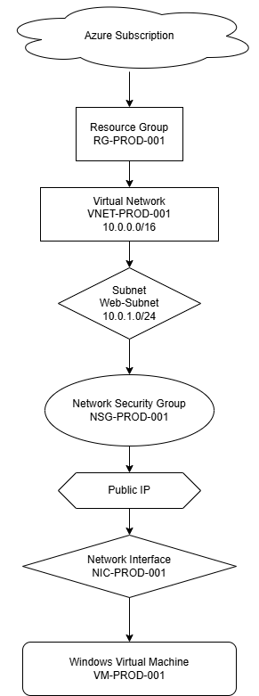

# Terraform Azure Modular Network Foundation

## Project Overview

This project demonstrates how to deploy Azure infrastructure using reusable Terraform modules following Infrastructure as Code (IaC) best practices.

The deployment includes:

- Resource Group
- Virtual Network
- Subnet
- Network Security Group
- NSG Association
- Public IP
- Network Interface
- Windows Virtual Machine

The objective of this project is to demonstrate modular Terraform design instead of writing everything inside a single main.tf file.

---

## Architecture



---

## Project Structure

```
terraform-azure-modular-network-foundation
│
├── diagrams
│   ├── architecture.drawio
│   └── architecture.png
│
├── docs
│
├── modules
│   ├── resource-group
│   ├── virtual-network
│   ├── subnet
│   ├── network-security-group
│   ├── subnet-nsg-association
│   ├── public-ip
│   ├── network-interface-card
│   └── vm
│
├── screenshots
│
├── main.tf
├── variables.tf
├── outputs.tf
├── providers.tf
├── versions.tf
├── terraform.tfvars
└── README.md
```

---

## Prerequisites

- Azure Subscription
- Azure CLI
- Terraform
- Visual Studio Code

---

## Deployment

Initialize Terraform

```
terraform init
```

Validate

```
terraform validate
```

Plan

```
terraform plan
```

Deploy

```
terraform apply
```

Destroy Resources

```
terraform destroy
```

---

## Outputs

- Resource Group Name
- Virtual Network Name
- Subnet Name
- VM Name
- Resource IDs

---

## Technologies Used

- Microsoft Azure
- Terraform
- AzureRM Provider
- Git
- GitHub
- Visual Studio Code

---

## Author

Vitthal Gawade
Azure Infrastructure Engineer